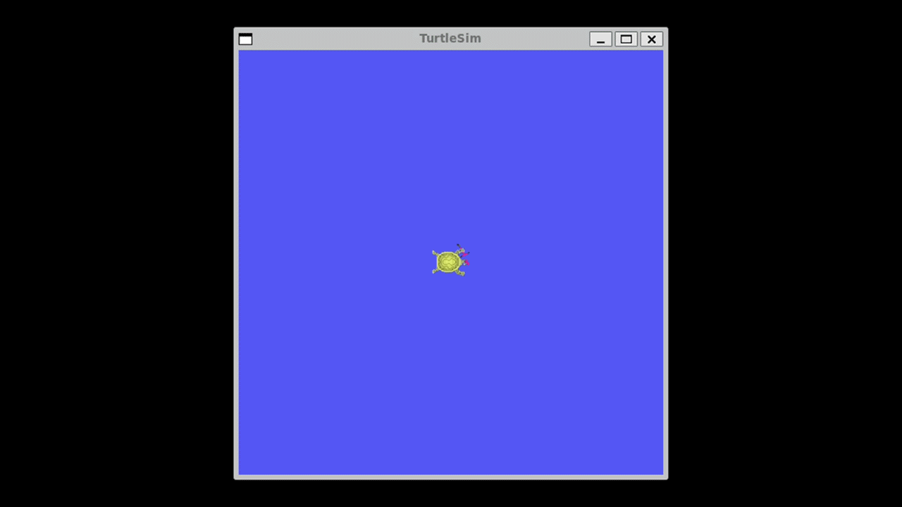

# ROS 2 Turtlesim Square Motion Control


Control the `turtlesim` node in ROS 2 using a Python state machine to drive the turtle in a precise, closed-loop square path using real-time position and orientation feedback.

---

## Demonstration

<p align="center">
  
</p>

---

## Project Overview

This project demonstrates precise closed-loop geometric path control in ROS 2 using the `turtlesim` simulator.

The Python node subscribes to `/turtle1/pose` to receive real-time positional and orientation updates, and publishes velocity commands to `/turtle1/cmd_vel`.

The turtle calculates four sequential corner coordinates based on its initial position and orientation. It then moves toward each corner while continuously correcting its heading. After reaching each corner, the turtle rotates 90 degrees before continuing toward the next corner.

A two-state Finite State Machine (FSM) is used to control the complete motion:

* **State 0 — Move to Corner:** Move toward the current target while applying heading correction.
* **State 1 — Turn 90 Degrees:** Rotate in place toward the next required orientation.

This closed-loop approach allows the turtle to follow a precise square path without relying on fixed movement durations.

---

## Project Structure

```text
turtle_square_project/
│
├── demo/
│   └── turtle_square.gif
│
└── turtle_square.py
```

---

## State Machine & Motion Sequence

The node operates using two states:

| State | Name                | Objective                                                      | Transition Condition       |
| :---: | :------------------ | :------------------------------------------------------------- | :------------------------- |
|  `0`  | **MOVE TO CORNER**  | Drive toward the current target corner with heading correction | Distance `< 0.02 m`        |
|  `1`  | **TURN 90 DEGREES** | Rotate in place toward the next heading                        | Angular error `< 0.01 rad` |

### Motion Logic Flow

```text
                Initialize Turtle Pose
                         │
                         ▼
             Calculate 4 Target Corners
                         │
                         ▼
              ┌─────────────────────┐
              │ State 0             │
              │ MOVE TO CORNER      │
              └──────────┬──────────┘
                         │
                   Corner Reached?
                         │
                         ▼
              ┌─────────────────────┐
              │ State 1             │
              │ TURN 90 DEGREES     │
              └──────────┬──────────┘
                         │
                   Rotation Complete?
                         │
                         ▼
               Update Side & Target
                         │
                         └──────────────► State 0
```

---

## Mathematical Implementation

### 1. Sequential Corner Generation

When the first pose message is received, the node stores the turtle's initial position and orientation.

The four target corners are then calculated sequentially using a side length of:

$$
L = 2.0\text{ m}
$$

For each side:

$$
\theta_i = \theta_0 + i\frac{\pi}{2}
$$

$$
x_{i+1} = x_i + L\cos(\theta_i)
$$

$$
y_{i+1} = y_i + L\sin(\theta_i)
$$

where:

* $L$ is the square side length.
* $\theta_0$ is the initial turtle orientation.
* $(x_i, y_i)$ is the previous corner.
* $(x_{i+1}, y_{i+1})$ is the next corner.

The corners are calculated sequentially so that each target is based on the previous corner, forming the complete square perimeter.

---

### 2. Heading Correction During Translation

While moving toward a target corner, the node continuously calculates the desired direction:

$$
\theta_{\text{desired}} =
atan2(y_t-y,\ x_t-x)
$$

The heading error is normalized to prevent angle wrap-around:

$$
e_\theta =
normalize_angle(\theta_{\text{desired}}-\theta)
$$

The angular velocity is then controlled proportionally:

$$
\omega_z =
clamp(1.5e_\theta,\ -0.3,\ 0.3)
$$

This allows the turtle to continuously correct its heading while moving toward the target.

---

### 3. Distance-Based Motion Control

The turtle moves at:

```text
1.0 m/s
```

while it is far from the target.

When the turtle gets within `0.3 m` of the target, the linear velocity is reduced to:

```text
0.3 m/s
```

This provides smoother and more controlled corner approaches.

When:

```text
distance < 0.02 m
```

the turtle stops and switches to the turning state.

---

### 4. In-Place 90-Degree Rotation

After reaching a corner, the next desired orientation is calculated as:

$$
\theta_{\text{next}} =
normalize_angle
\left(
\theta_0 + (side+1)\frac{\pi}{2}
\right)
$$

The angular error is:

$$
e_\theta =
normalize_angle(\theta_{\text{next}}-\theta)
$$

The rotation velocity is controlled proportionally:

$$
\omega_z =
clamp(2.0e_\theta,\ -1.0,\ 1.0)
$$

The turtle stops rotating when:

```text
|angular error| < 0.01 rad
```

The current side is then updated, the next target corner is selected, and the FSM returns to the **MOVE TO CORNER** state.

---

## Functions Explanation

### `__init__()`

Initializes the ROS 2 node and configures the main components:

* Publisher for `/turtle1/cmd_vel`
* Subscriber for `/turtle1/pose`
* Turtle pose variables
* Square side length
* FSM state
* Current side
* Target coordinates
* Timer with a `0.01 s` period

The timer runs the control loop at approximately **100 Hz**.

### `pose_callback(msg)`

Receives the turtle's real-time pose.

On the first callback, it:

1. Stores the starting position.
2. Stores the starting orientation.
3. Calculates the four sequential target corners.
4. Sets the first corner as the initial target.

### `normalize_angle(angle)`

Normalizes an angle to the range:

$$
[-\pi,\pi]
$$

using:

```python
math.atan2(
    math.sin(angle),
    math.cos(angle)
)
```

This prevents orientation comparison problems caused by angle wrap-around.

### `timer_callback()`

Contains the main motion-control logic.

**State 0 — Move to Corner:**

* Calculates the distance to the target.
* Calculates the desired heading.
* Applies proportional heading correction.
* Controls the linear velocity.
* Switches to the turning state when the corner is reached.

**State 1 — Turn 90 Degrees:**

* Calculates the next desired orientation.
* Calculates the angular error.
* Rotates the turtle in place.
* Updates the current side and target.
* Returns to the moving state when the rotation is complete.

---

## Running the Project

### Prerequisites

* ROS 2 Humble
* Python 3
* `turtlesim` package

### 1. Launch Turtlesim

Open a terminal and run:

```bash
ros2 run turtlesim turtlesim_node
```

### 2. Run the Python Node

Open another terminal, navigate to the project directory, and run:

```bash
python3 turtle_square.py
```

The turtle will automatically calculate its four target corners and begin following the square path.

---

## Topics Used

| Topic              | Type                      | Purpose                                       |
| :----------------- | :------------------------ | :-------------------------------------------- |
| `/turtle1/pose`    | `turtlesim/msg/Pose`      | Receive the turtle's position and orientation |
| `/turtle1/cmd_vel` | `geometry_msgs/msg/Twist` | Send linear and angular velocity commands     |

---

## Technologies Used

* **ROS 2 Humble**
* **Python 3**
* **rclpy**
* **Turtlesim**
* **geometry_msgs**
* **turtlesim messages**

---

## Learning Outcomes

* Implementing ROS 2 publishers and subscribers.
* Controlling a simulated robot using velocity commands.
* Using real-time pose feedback for closed-loop motion control.
* Designing a Finite State Machine (FSM) for sequential robot behaviors.
* Calculating geometric waypoints using position and orientation.
* Applying proportional heading correction.
* Normalizing angles for reliable orientation control.
* Understanding basic 2D robot navigation and motion control.

---

## Author

**Nawaf Alharbi**
